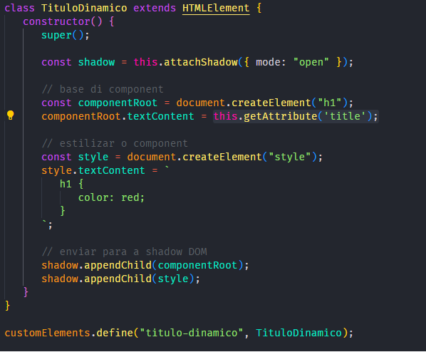

# Web Component na prática

Estudo de web component com Javascript proposto em um curso do bootcamp Cloud Fullstack Bootcamp - Warburg Pincus da Digital Inovation One (DIO)

## O que é web component?

É um conjunto de código HTML e estilo criados por Javascript que podem ser reutilizáveis dentro do site.

São classes usadas como "templates" para gerar diversos elementos do site que sejam muito parecidos, como no exemplo abaixo.

## Tecnologias usadas:

- HTML5
- CSS3
- Javascript
